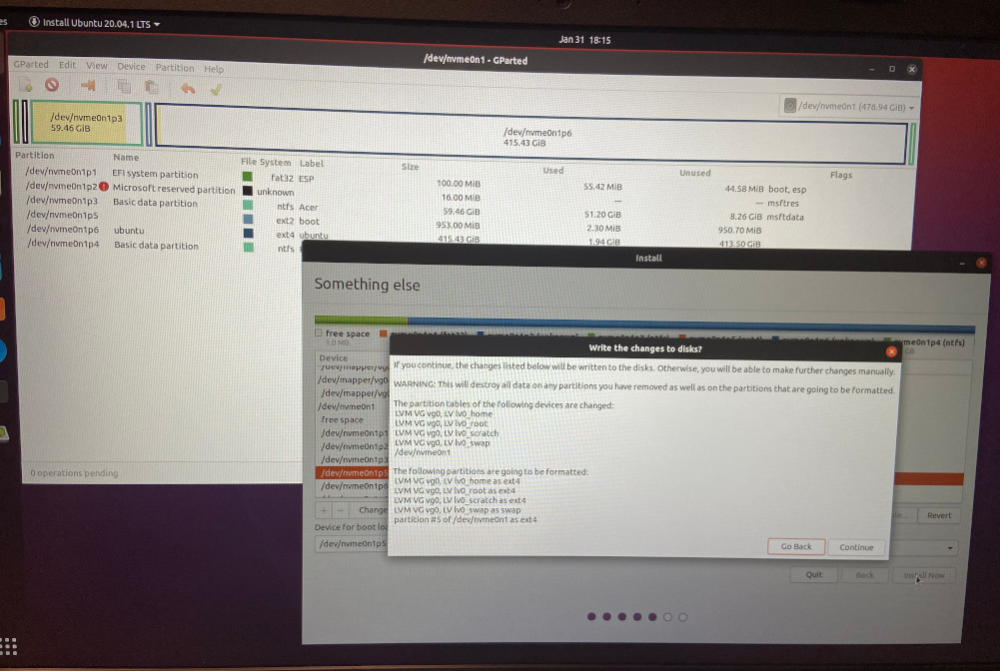

# Dual Boot Encrypted Ubuntu 20.04 and Windows 10

I bought a new machine. Don't ask me why I want to keep the Windows partition in the first place. I hardly use Windows, but who knows why it's good for.
* Model: Acer Aspire 5 A515-56-70XN
* Installation date: 31-01-2021

I followed these guides:
* https://fossbytes.com/install-ubuntu-20-04-with-windows-10-dual-boot/ 
* https://labbots.com/ubuntu-18-04-installation-with-luks-and-lvm/ and 
* https://gist.github.com/luispabon/db2c9e5f6cc73bb37812a19a40e137bc

## Preparation

Backup Windows: I unboxed the machine, started Windows, didn't connect to the internet, provided minimum info to Microsoft, then created a recovery usb stick using the Windows recovery options. Then I started "Disk Management" and used "Shrink Volume" on the C: drive to make it as small as possible. This shold leave some unallocated space we can use for the Ubuntu partition.

Restart laptop. Type F2 and go to the Boot menu and change the boot order to boot first from USB.

Bootable USB stick: I created mine on another Linux machine using `dd` to write an iso file to a USB stick. Today I used an Ubuntu 20.04 LTS iso.

## Partitioning and LUKS

Boot into the Ubuntu Live CD session.

Open `gparted`. Leave Windows partitiions and EFI untouched.

Use the unallocated space to create an unencrypted boot partition (ext2) and a partition for the encrypted system (ext4).

* `nvme0n1p5`: `/boot` (1G)
* `nvme0n1p6`: LUKS partition with label "ubuntu" (the rest of the disk)

Apply changes.


Create LUKS container on `/dev/nvme0n1p6`.
```
sudo cryptsetup luksFormat --hash=sha512 --key-size=512 --cipher=aes-xts-plain64 --verify-passphrase /dev/nvme0n1p6
sudo cryptsetup luksOpen /dev/nvme0n1p6 CryptDisk
```
I didn't overwrite the partition with zeros or random data given that the machine was brandnew. Otherwise you should use `sudo dd if=/dev/zero of=/dev/mapper/CryptDisk bs=4M`. This takes a long time, so good to be patient (which I'm not).


Setup LVM on `/dev/mapper/CryptDisk`:
```
sudo pvcreate /dev/mapper/CryptDisk
sudo vgcreate vg0 /dev/mapper/CryptDisk
sudo lvcreate -n lv0_swap -L 20G vg0
sudo lvcreate -n lv1_root -L 30G vg0
sudo lvcreate -n lv2_home -L 16G vg0
sudo lvcreate -n lv3_scratch -l +100%FREE vg0
```

## Installation

Don't reboot. Just start the installation process using the GUI of the live CD:
  * Connect to the WiFi network.
  * When asked what to do with the disk, go for the "Something else" option:
     * Configure `/dev/mapper/vg0-lv0_swap` as `swap`
     * Configure `/dev/mapper/vg0-lv1_root` as `ext4` and mount it to `/`
     * Configure `/dev/mapper/vg0-lv2_home` as `ext4` and mount it to `/home`
     * Configure `/dev/mapper/vg0-lv3_scratch` as `ext4` and mount it to `/scratch`
     * Configure `/dev/nvme0n1p5` as `ext4` and mount it to `/boot`
     * Configure the "boot drive" in the drop down menu at the bottom (this is where GRUB goes) and assign it to `/dev/nvme0n1p5`.



* Proceed with the installation.
* **When the installation is complete, don't reboot! Choose the option to "Continue Testing".**


## Post-installation configuration before reboot

We need to make sure that the boot process knows how to decrypt the LUKS partition.

Check the UUID of the LUKS drive:
```
$ sudo blkid /dev/nvme0n1p5
/dev/nvme0n1p5: UUID="93fdc766-4f72-4ed8-a1d0-887343d17cc9" TYPE="ext4" PARTUUID="70c9144b-ba22-4c3c-9861-b5885174dc0d"
```
Mount `root` and `boot` drives and `chroot` into the main mount:

```
sudo mount /dev/mapper/vg0-lv1_root /mnt
sudo mount /dev/nvme0n1p5 /mnt/boot
sudo mount --bind /dev /mnt/dev
sudo chroot /mnt
mount -t proc proc /proc
mount -t sysfs sys /sys
mount -t devpts devpts /dev/pts
```

Configure `crypttab` so boot knows where to find the LUKS partition with `sudo vi /etc/crypttab`:
```
# <target name> <source device> <key file> <options>
# options used:
#     luks    - specifies that this is a LUKS encrypted device
#     tries=0 - allows to re-enter password unlimited number of times
#     discard - allows SSD TRIM command, WARNING: potential security risk (more: "man crypttab")
#     loud    - display all warnings
CryptDisk UUID=197934dd-c9b7-479c-88eb-e6f6f1ef885e none luks,tries=0,discard,loud
```

Check that all is good:
```
$ sudo lsblk
NAME                  MAJ:MIN RM   SIZE RO TYPE  MOUNTPOINT
nvme0n1               259:0    0   477G  0 disk
├─nvme0n1p1           259:1    0   100M  0 part  /boot/efi
├─nvme0n1p2           259:2    0    16M  0 part
├─nvme0n1p3           259:3    0  59,5G  0 part
├─nvme0n1p4           259:4    0     1G  0 part
├─nvme0n1p5           259:5    0   953M  0 part  /boot
└─nvme0n1p6           259:6    0 415,4G  0 part
  └─CryptDisk         253:0    0 415,4G  0 crypt
	  ├─vg0-lv0_swap    253:1    0    20G  0 lvm   [SWAP]
	  ├─vg0-lv1_root    253:2    0    30G  0 lvm   /
	  ├─vg0-lv2_home    253:3    0    16G  0 lvm   /home
	  └─vg0-lv3_scratch 253:4    0 349,4G  0 lvm   /scratch
```

Run `update-initramfs -k all -c`

Reboot into Ubuntu

## Extras

I had some issues with the touchpad that suddenly neither responded in Windows or Ubuntu. I reinstalled the I/O driver in Windows, rebooted, and then the touchpad was back. No idea if this was what fixed it. But all the same.

See also my [Ubuntu Checklist](ubuntu-config.md) for first steps in Ubuntu.
